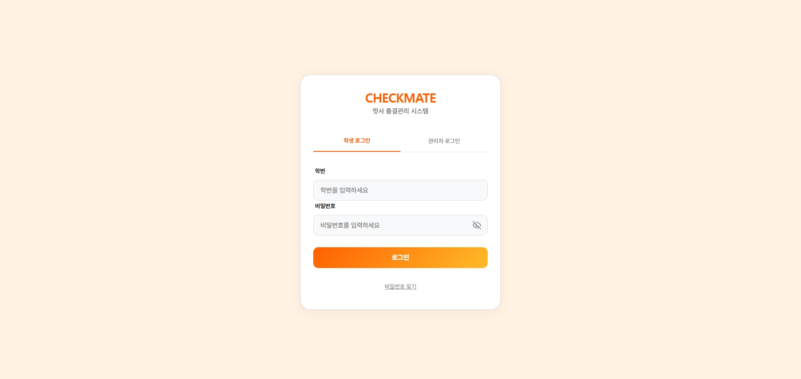
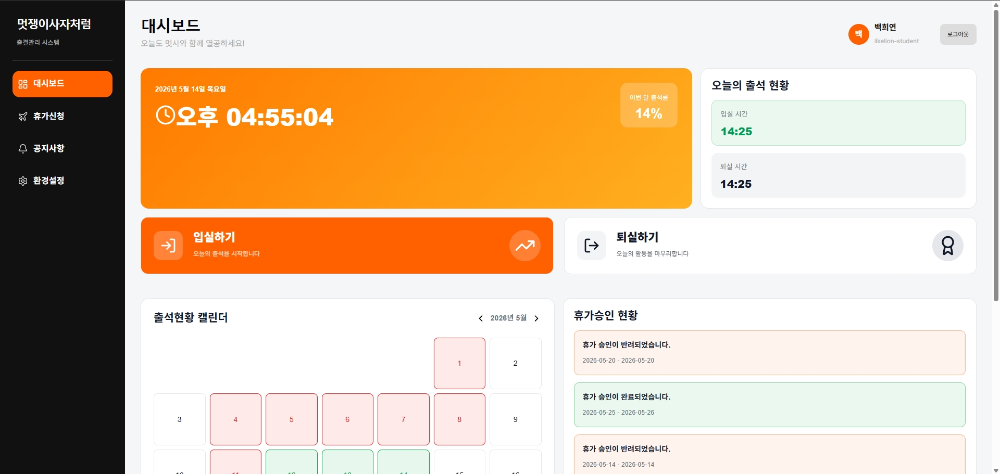
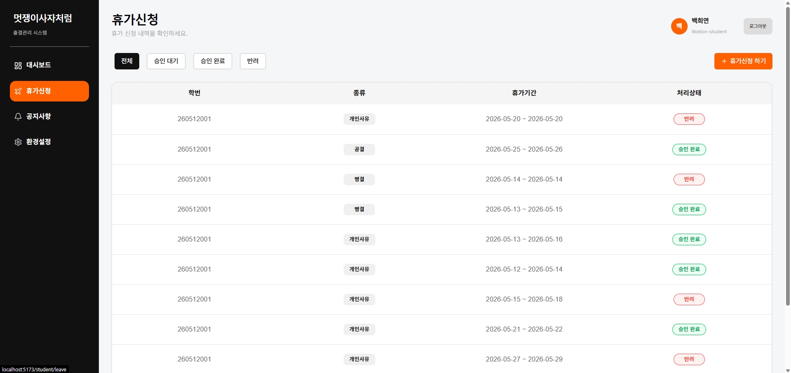
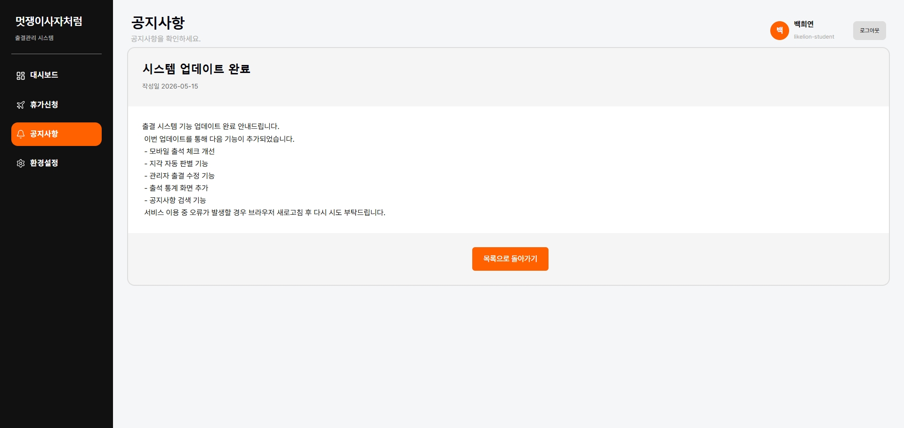
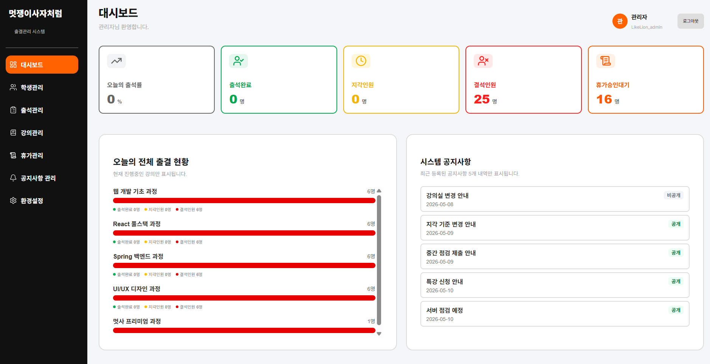
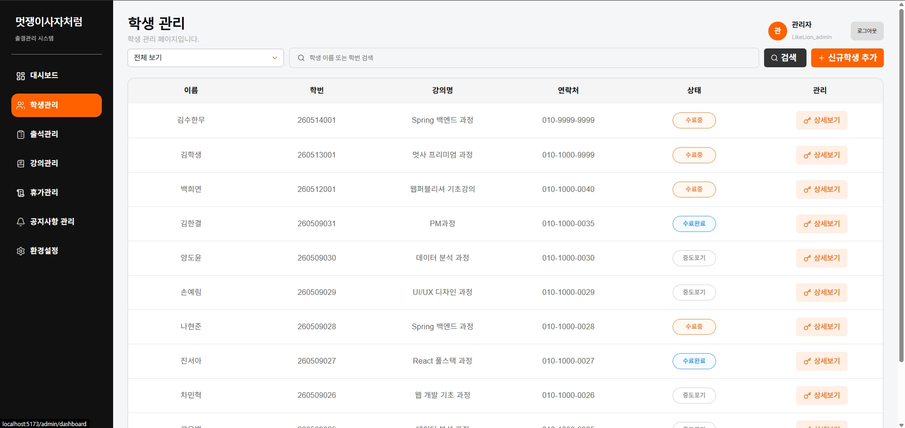
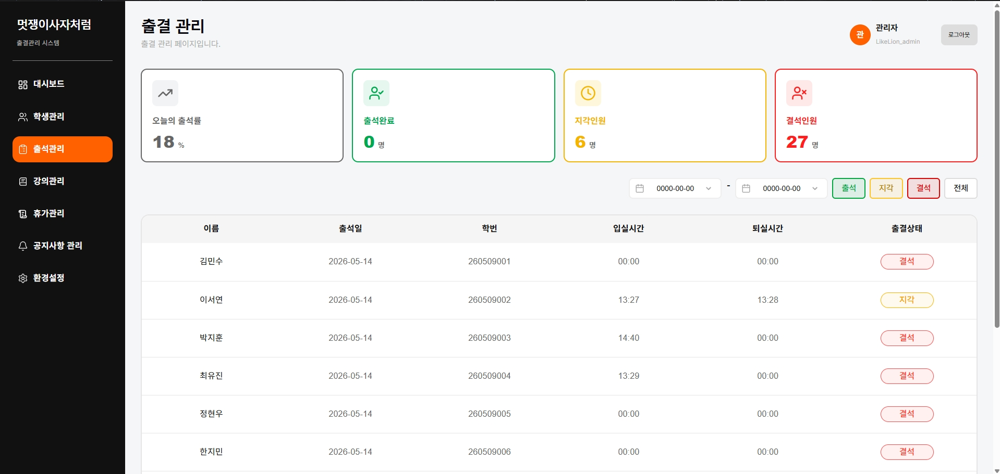
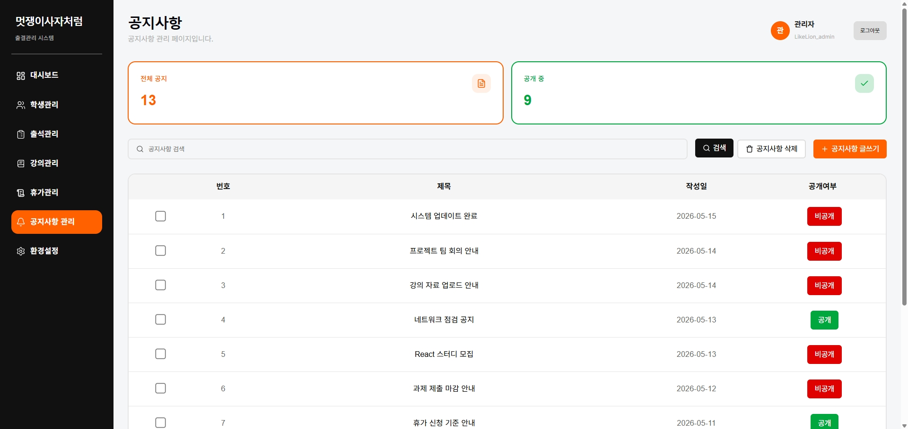
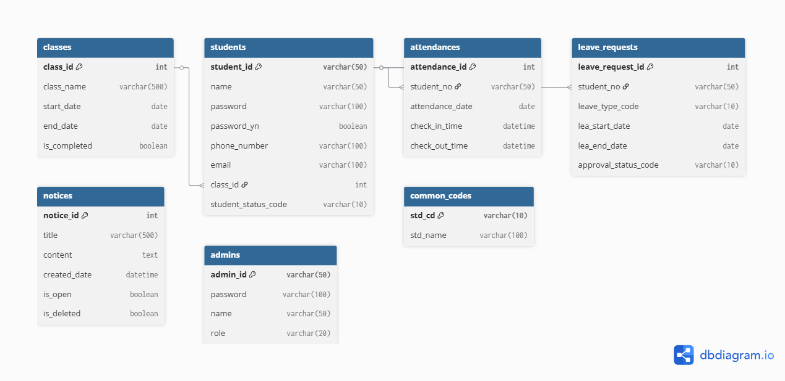

<div align="center">

# ♟️ Checkmate

### React 기반 출결 관리 시스템

<br />

<a href="https://final-checkmate.netlify.app/">
  
</a>

<a href="https://final-project-team1.onrender.com/swagger-ui/index.html">
  
</a>

</div>

---

## 📌 프로젝트 소개

학생과 관리자 권한에 따라 출결 현황 조회, 휴가 신청, 공지사항 및 학생·강의 관리 기능을 제공하는 React 기반 출결 관리 시스템

| 항목      | 내용                           |
| --------- | ------------------------------ |
| 개발 기간 | 2026.04.16 ~ 2026.05.19 (5주)  |
| 팀 구성   | 5인                            |
| 서비스    | 학생 포털 / 관리자 어드민      |
| 지원 환경 | Desktop · Tablet 반응형 웹     |
| Frontend  | React · TypeScript · Vite      |
| Backend   | Spring Boot · MySQL            |
| 배포 환경 | Netlify · Render · Aiven MySQL |

## 🔗 Project Links

- Service  
  https://final-checkmate.netlify.app/

- API Docs (Swagger)  
  https://final-project-team1.onrender.com/swagger-ui/index.html

- WBS  
  https://docs.google.com/spreadsheets/d/1FtVwEGyxLy-u7XBxii0xNnxMp_u-ThXnVulO8N3tmGA/edit?gid=0#gid=0

---

## ✨ 주요 기능 및 화면 구성

## 👨‍🎓 학생

| 화면명           | 설명                                |
| ---------------- | ----------------------------------- |
| 🔐 로그인        | 학생 및 관리자 로그인, JWT 인증     |
| 👨‍🎓 학생 대시보드 | 출결 현황, 공지사항, 휴가 현황 조회 |
| 📝 휴가 신청     | 휴가 신청 및 신청 내역 조회         |
| 📢 공지사항      | 공지사항 목록 및 상세 조회          |
| ⚙️ 학생 설정     | 계정 정보 조회 및 비밀번호 변경     |

---

## 👨‍💼 관리자

| 화면명             | 설명                            |
| ------------------ | ------------------------------- |
| 👨‍💼 관리자 대시보드 | 출결 및 휴가 현황 통계 조회     |
| 📚 강의 관리       | 강의 목록 조회, 등록, 수정      |
| 👥 학생 관리       | 학생 목록 조회, 등록, 수정      |
| 📊 출결 관리       | 출결 상태 및 날짜별 출결 조회   |
| ✅ 휴가 관리       | 휴가 승인 및 반려 처리          |
| 📢 공지사항 관리   | 공지사항 목록 조회, 등록, 수정  |
| ⚙️ 관리자 설정     | 계정 정보 조회 및 비밀번호 변경 |

## 📷 화면 미리보기

### 👨‍🎓 학생 화면

| 🔐 로그인                                               | 👨‍🎓 학생 대시보드                                               |
| ------------------------------------------------------- | -------------------------------------------------------------- |
|  |  |
| 학생 / 관리자 로그인                                    | 출결 현황 및 공지사항 조회                                     |

| 📝 휴가 신청                                                         | 📢 공지사항 상세                                                   |
| -------------------------------------------------------------------- | ------------------------------------------------------------------ |
|  |  |
| 휴가 신청 및 내역 조회                                               | 공지사항 상세 조회                                                 |

---

### 👨‍💼 관리자 화면

| 📊 관리자 대시보드                                               | 👥 학생 관리                                                     |
| ---------------------------------------------------------------- | ---------------------------------------------------------------- |
|  |  |
| 출결 통계 및 현황 조회                                           | 학생 등록 / 수정 / 검색                                          |

| 🗓️ 출결 관리                                                     | ✏️ 공지사항 관리                                                     |
| ---------------------------------------------------------------- | -------------------------------------------------------------------- |
|  |  |
| 날짜 / 상태별 출결 조회                                          | 공지사항 등록 / 수정 / 삭제                                          |

## 🛠️ 기술 스택

### 🖥️ 프론트엔드

| 구분              | 기술                                                         |
| ----------------- | ------------------------------------------------------------ |
| Frontend          | React 19, TypeScript 6.0, Vite 8                             |
| 라우팅 / 상태관리 | React Router DOM 7, Zustand 5                                |
| 데이터 통신       | Axios 1                                                      |
| 인증              | jwt-decode                                                   |
| 폼 / 검증         | React Hook Form 7, Zod 3                                     |
| UI / 라이브러리   | React Quill New, Lucide React, React Icons, React Datepicker |
| 유틸리티          | date-fns                                                     |
| 보안 / 코드 품질  | DOMPurify, ESLint, TypeScript ESLint                         |

### ⚙️ 백엔드

| 구분           | 기술                                 |
| -------------- | ------------------------------------ |
| Backend        | Java 17, Spring Boot 3.5             |
| Database / ORM | MySQL (Aiven Cloud), Spring Data JPA |
| 인증           | Spring Security, JWT                 |
| 유틸리티       | Lombok, Spring Boot Validation       |
| API 문서       | Swagger, SpringDoc OpenAPI           |
| 빌드 / 배포    | Gradle, Docker                       |

### 🤝 개발 및 협업 도구

| 구분      | 기술                                     |
| --------- | ---------------------------------------- |
| 개발 도구 | IntelliJ IDEA, VS Code, DBeaver, Postman |
| 협업 도구 | GitHub, Notion, Figma, Discord           |

---

## 📂 폴더 구조

```text
final-project-team1
 ┣ frontend
 ┃ ┗ src
 ┃   ┣ api             # Axios 인스턴스 및 공통 API 설정
 ┃   ┣ assets          # 이미지, 아이콘 등 정적 파일
 ┃   ┣ components      # 공통 UI 컴포넌트 (버튼, 모달, 테이블, 헤더, 사이드바 등)
 ┃   ┣ pages           # 라우팅 페이지
 ┃   ┃ ┣ auth          # 로그인 / 비밀번호 찾기
 ┃   ┃ ┣ student       # 학생 페이지 (dashboard / leave / notice / settings)
 ┃   ┃ ┗ admin         # 관리자 페이지 (dashboard / lecture / student / attendance / leave / notice / settings)
 ┃   ┣ routes          # React Router 설정 (권한별 라우팅 분기)
 ┃   ┣ store           # Zustand 전역 상태
 ┃   ┣ styles          # global.css, reset.css
 ┃   ┣ types           # 전역 TypeScript 타입 정의
 ┃   ┗ utils           # 유틸리티 함수 (날짜 포맷 등)
 ┣ backend
 ┗ README.md
```

> 각 도메인(auth, attendance, notice, leave, user) 내부에 페이지별 CSS를 함께 관리합니다.

---

## 🗂️ ERD



---

## 🔐 인증 방식

| 방식                | 설명                    |
| ------------------- | ----------------------- |
| JWT                 | 토큰 기반 인증          |
| Spring Security     | 서버 보안 처리          |
| Protected Route     | 프론트 라우팅 보호      |
| Role 기반 접근 제어 | 학생 / 관리자 권한 분리 |

---

## 👥 팀원 소개 및 담당 역할

> 🔗 이름을 클릭하면 GitHub 프로필로 이동합니다

<div align="center">

| <a href="https://github.com/developer-kyul"></a> | <a href="https://github.com/HeeYeonBaek"></a> | <a href="https://github.com/jyeonleee"></a> | <a href="https://github.com/baakainu"></a> | <a href="https://github.com/yuyeongE"></a> |
| :-----------------------------------------------------------------------------------------------------------------------: | :-----------------------------------------------------------------------------------------------------------------: | :-------------------------------------------------------------------------------------------------------------: | :-----------------------------------------------------------------------------------------------------------: | :-----------------------------------------------------------------------------------------------------------: |
|                                      **[김한결](https://github.com/developer-kyul)**                                      |                                    **[백희연](https://github.com/HeeYeonBaek)**                                     |                                   **[이주연](https://github.com/jyeonleee)**                                    |                                   **[정인우](https://github.com/baakainu)**                                   |                                   **[윤유영](https://github.com/yuyeongE)**                                   |
|                                                  관리자 강의 · 학생 관리                                                  |                                              학생 휴가 신청 · 공지사항                                              |                                          관리자 출결 · 휴가 · 공지사항                                          |                                           로그인 · 학생/관리자 설정                                           |                                            학생 · 관리자 대시보드                                             |

</div>
